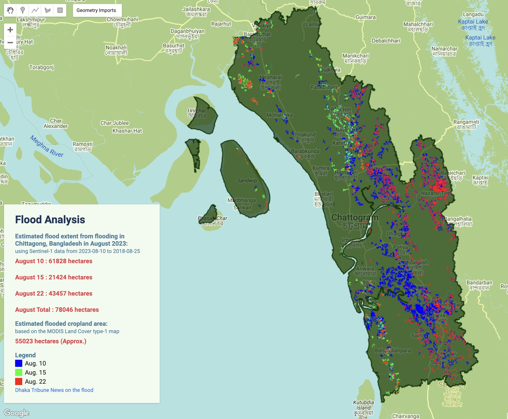

#### _Cyclone Hamoon Animation_
> Using Google Earth Engine and precipitation data of 3 days the animated thumbnail is created.  
[GEE Project Link](https://code.earthengine.google.com/435532e3ff14bc4dc38ba7eced5373af)    

  

#### _Flood Map of Chittagong using Sentinel-1_
> Synthetic Aperture Radar data was used with filtering algorithms to produce this inundation map of the Chittagong district.  
[GEE Project Link](https://code.earthengine.google.com/ef2b50e4143de975f895eafcb5fb5eeb)    

